# Manuale Utente LiSA

## Indice dei contenuti

- [Introduzione](#introduzione)
- [Panoramica dell’interfaccia](#panoramica-dellinterfaccia)
- [Guida alla configurazione](#guida-alla-configurazione)
  - [Requisiti e Permessi](#requisiti-e-permessi)
  - [Utilizzo Offline](#utilizzo-offline)
- [Guida alle Funzionalità](#guida-alle-funzionalità)
  - [Gestione Lista Spesa](#gestione-lista-spesa)
  - [Gestione Ricette](#gestione-ricette)
  - [Gestione Negozi e Carte Fedeltà](#gestione-negozi-e-carte-fedeltà)
    - [Codice Fiscale e Lotteria degli Scontrini](#codice-fiscale-e-lotteria-degli-scontrini)
  - [Utilizzo dei codici alla Cassa](#utilizzo-dei-codici-alla-cassa)
  - [Gestione Scontrini e Prezzi](#gestione-scontrini-e-prezzi)
    - [Consigli per l'AI (Migliori risultati)](#consigli-per-lai-migliori-risultati)
- [Impostazioni](#impostazioni)
- [Account](#account)
  - [Gestione Profilo e Licenze](#gestione-profilo-e-licenze)
  - [Backup e Ripristino Cloud](#backup-e-ripristino-cloud)
  - [Privacy e Sicurezza](#privacy-e-sicurezza-1)
- [Novità e Notifiche](#novità-e-notifiche)
- [Prossimi Sviluppi (Versione Premium)](#prossimi-sviluppi-versione-premium)
- [Diagnostica AI](#diagnostica-ai)
- [Azioni Rapide e Comandi Vocali](#azioni-rapide-e-comandi-vocali)
- [Utilizzo a mani libere (Android Auto / Ok Google)](#utilizzo-a-mani-libere-android-auto--ok-google)
- [Consigli ed esempi di utilizzo](#consigli-ed-esempi-di-utilizzo)
- [FAQ / Risoluzione Problemi](#faq--risoluzione-problemi)
- [Utilizzo dell'Intelligenza Artificiale](#utilizzo-dellintelligenza-artificiale)
- [Appendice Tecnica](#appendice-tecnica)

---

## Introduzione

Benvenuto in **LiSA**, la tua assistente personale per la spesa!

LiSA è stata progettata per semplificarti la vita quotidiana: non è solo una lista della spesa, ma un sistema intelligente che ti aiuta a organizzare le tue ricette preferite, gestire le carte fedeltà e tenere d'occhio i prezzi grazie all'aiuto dell'intelligenza artificiale. Che tu stia pianificando la cena o analizzando lo scontrino appena ricevuto, LiSA è qui per aiutarti a ottimizzare il tempo e risparmiare.

---

## Panoramica dell’interfaccia

L’interfaccia di LiSA è pensata per essere semplice e immediata. Ecco come orientarti:

  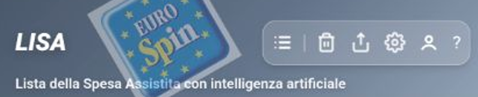

### Header (La barra in alto)

- Qui trovi il logo LiSA e il nome dell’app.
- **Visualizzazione dinamica**: Quando selezioni un negozio che ha una carta fedeltà associata, il **logo della carta** apparirà direttamente nell'header. Questo ti permette di avere la tua tessera sempre a vista e pronta all'uso senza dover navigare tra i menu.
- Sulla destra trovi i pulsanti rapidi per le impostazioni e per controllare lo stato del tuo account.
- Se sei senza internet o ci sono novità, troverai dei piccoli avvisi proprio qui (toccandoli potrai accedere direttamente alla cronologia delle notifiche).

### Barra delle funzioni (In alto a destra)

LiSA non usa un singolo menu a scomparsa, ma ti offre tutto quello che serve direttamente nella barra in alto. Ecco cosa trovi nelle diverse sezioni:

- **Lista della Spesa (Icona lista )**: Da qui puoi gestire come visualizzare la tua lista (nascondere i prodotti già presi 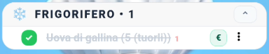 o chiudere i reparti) e selezionare velocemente in quale **Negozio** ti trovi o quale **Carta Fedeltà** usare. Se hai attivato l'AI, troverai qui anche la funzione per analizzare **Scontrini e Scaffali**.
- **Cancellazione (Icona cestino )**: Ti permette di fare pulizia velocemente. Puoi scegliere se togliere solo i prodotti già "spuntati" o se svuotare completamente la lista per ricominciare da zero.
- **Condivisione (Icona freccia )**: Utile per mandare la lista a qualcuno! Puoi copiarla come testo negli appunti o condividerla direttamente tramite le tue app preferite (come WhatsApp o Telegram).
- **Configurazione (Icona ingranaggio )**: Accedi alle impostazioni per personalizzare l'aspetto dell'app, gestire le notifiche e configurare il comportamento di LiSA in base alle tue abitudini.
- **Account (Icona omino )**: Gestisci i tuoi dati personali, il backup sul cloud e, soprattutto, inserisci le tue **Chiavi API** per sprigionare tutta la potenza dell'intelligenza artificiale.
- **? (Icona punto di domanda )**: Un aiuto sempre a portata di mano. Da qui puoi rileggere questo manuale o consultare le domande frequenti (FAQ) per risolvere ogni tuo dubbio.

### Area di lavoro centrale

È il cuore pulsante di LiSA, induve gestisci la tua **Lista della Spesa**.

  
  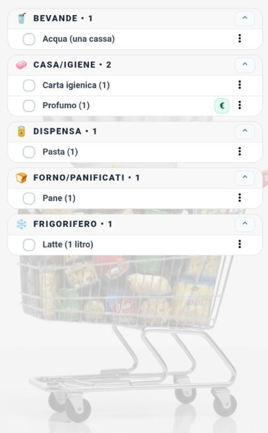

- **I tuoi prodotti**: Qui vedi tutti gli articoli che hai aggiunto, ordinati automaticamente per **Reparto** (Frutta, Surgelati, Dispensa, ecc.) così da seguirti naturalmente nel percorso tra le corsie.
- **Interazione semplice**: Basta un tocco sul nome di un prodotto per "spuntarlo" quando lo metti nel carrello. Se hai bisogno di cambiare quantità o aggiungere una nota, tocca i tre puntini a destra di ogni articolo.
- **Tutto a portata di mano**: Anche se la lista è sempre al centro, le altre funzioni (come il dettaglio di una ricetta o la gestione di un negozio) appariranno in finestre sovrapposte così non perderai mai il segno di dove sei arrivato con la spesa.
- **Chiusura rapida reparti**: Se la lista è molto lunga, puoi "chiudere" un reparto toccando il suo titolo per passare velocemente a quello successivo. 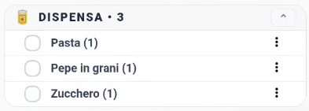 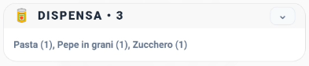

### Barra di inserimento e Assistente Intelligente

In fondo allo schermo trovi lo strumento più potente di LiSA. Non serve solo a scrivere, ma è il tuo filo diretto con l'intelligenza artificiale:

- **Scrittura Rapida**: Inserisci i nomi dei prodotti e premi invio. LiSA ti suggerirà i prodotti che già conosce (perché inseriti in precedenza o imparati dai tuoi scontrini), velocizzando la compilazione.
- **Parla con LiSA (Icona Microfono )**: Tocca il microfono e detta la tua spesa. Puoi dire cose come "Prendi due litri di latte, un chilo di farina e delle uova" e LiSA organizzerà tutto per te.
- **Riconoscimento Prodotto (Pressione prolungata 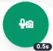)**: Se tieni premuto il pulsante del microfono per circa mezzo secondo, l'icona diventerà verde e si aprirà la fotocamera. Scatta una foto a un prodotto che hai in mano e LiSA lo riconoscerà e lo aggiungerà alla lista!
- **Richieste Complesse**: Grazie all'IA attiva, puoi scrivere o dire frasi come "Cosa mi serve per fare una torta di mele?" o "Aggiungi tutto il necessario per la cena di stasera" e LiSA ti aiuterà a compilare la lista in un attimo.

  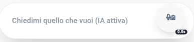

---

## Guida alla configurazione

Iniziare con LiSA è facilissimo!

Per configurare al meglio LiSA e sbloccare tutte le sue potenzialità, consulta la [Guida Dettagliata Configurazione IA](./MANUALE_IA.html) per imparare come ottenere e inserire la tua chiave API personale.

### Tabella Comparativa Funzionalità
Di seguito una tabella che riassume cosa è possibile fare con l'IA attiva rispetto alla versione base:

| Funzionalità | IA Attiva ✅ | IA Disattivata ❌ |
| :--- | :--- | :--- |
| **Inserimento Naturale** | **Sì** (es: "Prendi latte e uova" crea 2 prodotti) | **No** (Crea un unico prodotto "Prendi latte e uova") |
| **Classificazione Reparti** | **Automatica** (Latte -> Frigorifero) | **Manuale** (Richiesta ad ogni inserimento) |
| **Ricette dai Social** | **Sì** (Estrae ingredienti da YouTube, IG, TikTok, etc) | **No** |
| **Assistente Chef** | **Sì** (Risposte dettagliate e consigli) | **Limitato** (Solo funzioni base offline) |
| **Analisi Foto/Scontrini** | **Sì** (Riconosce i prodotti dalle immagini) | **No** |
| **Comandi Vocali** | **Avanzati** (Capisce frasi complesse e contesto) | **Base** (Riconoscimento limitato) |

### Primo avvio e registrazione

1. **Scarica LiSA**: La trovi sul Google Play Store o sul nostro sito ufficiale.
2. **Apri l'app**: Al primo avvio, LiSA ti accompagnerà nella creazione del tuo profilo.
3. **Crea il tuo account**: Inserisci la tua email e scegli una password sicura. Questo ti permetterà di non perdere mai i tuoi dati. Se dimentichi la password, non preoccuparti: puoi resettarla facilmente dalla schermata di accesso.

### Requisiti e Permessi

Per darti il massimo, LiSA ti chiederà alcuni permessi. Ecco perché servono:

- **Fotocamera**: Per leggere i codici a barre e "leggere" i tuoi scontrini con l'intelligenza artificiale.
- **Memoria**: Per salvare i tuoi backup e le immagini sul telefono.
- **Internet**: Serve per far funzionare l'assistente intelligente (Gemini) e sincronizzare i tuoi dati se usi il cloud.

  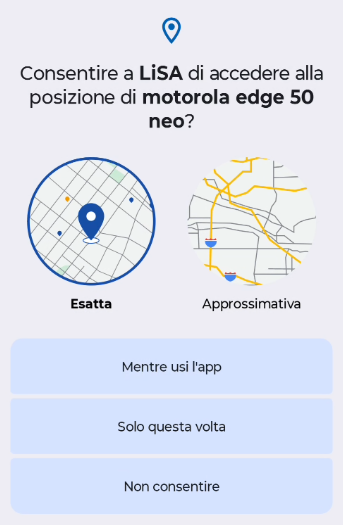

### Utilizzo Offline

Puoi usare LiSA anche in un supermercato dove non c'è campo!

- **Sempre disponibile**: Puoi vedere e modificare la tua lista, guardare le tue ricette e mostrare le tue carte fedeltà anche senza internet.
- **Richiede internet**: L'analisi automatica degli scontrini e degli scaffali, i suggerimenti intelligenti e il backup sul cloud hanno bisogno di una connessione attiva.

### Attivazione dell'Assistente Intelligente (Gemini)

L'attivazione dell'**Assistente Intelligente** è un passaggio fondamentale per sbloccare il vero potenziale di LiSA. Senza questo piccolo codice (chiamato "chiave API"), l'app funzionerà come una normale lista della spesa, ma perderà le sue capacità più avanzate: non potrà leggere gli scontrini dalle foto, non saprà suggerirti ricette basandosi su quello che scrivi e non potrà riconoscere i prodotti inquadrati con la fotocamera.

#### Perché usare una chiave personale?

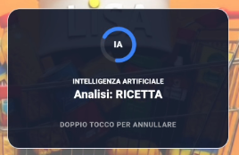

Abbiamo scelto di farti utilizzare una chiave personale per tre motivi principali:

1. **Gratuità**: I servizi di intelligenza artificiale hanno costi elevati. Usando la tua chiave, possiamo offrirti LiSA gratuitamente, poiché Google offre una generosa soglia di utilizzo gratis per ogni utente.
2. **Privacy**: Il rapporto di analisi dei dati avviene direttamente tra il tuo dispositivo e Google, garantendoti il controllo totale sulle tue informazioni.
3. **Potenza**: Una chiave personale ti garantisce una "corsia preferenziale". Per un uso quotidiano (fino a 15 richieste al minuto), avrai sempre un'assistente pronta e scattante.

---

#### Come ottenere e inserire la chiave

  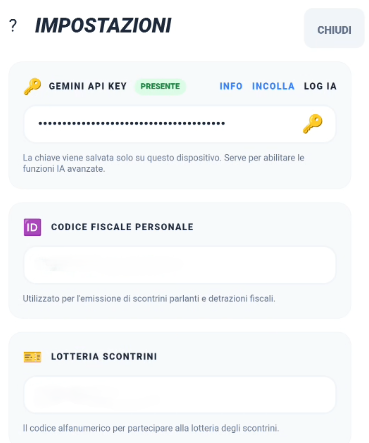

1. **Ottieni il codice**: Visita la pagina ufficiale [Google AI Studio](https://aistudio.google.com/app/apikey). Accedi con il tuo account Google e clicca sul pulsante per creare una nuova chiave (API Key).
2. **Copia il codice**: Ti verrà mostrata una stringa di lettere e numeri. Copiala con cura.
3. **Salvala in LiSA**:
   - Tocca l'**icona Account (l'omino)** nella barra delle funzioni in alto.
   - Seleziona la voce **Chiavi**.
   - Incolla il codice nel campo dedicato e salva.

Una volta salvata, LiSA diventerà molto più intelligente e pronta ad aiutarti!

 
 

---

## Guida alle Funzionalità

### Gestione Lista Spesa

- **Aggiunta rapida**: Inizia a scrivere e LiSA ti suggerirà i prodotti che ha già imparato dalle tue spese precedenti.
- **Inserimento Multiplo**: Se l'IA è **disattivata**, puoi inserire più prodotti contemporaneamente separandoli con una **virgola** (`,`), un **punto e virgola** (`;`), un **punto** (`.`) o semplicemente usando la parola "**e**". Se l'IA è **attiva**, puoi scrivere in modo del tutto naturale (es. _"Prendimi del pane, un po' di latte e anche le uova"_): l'assistente capirà da sola come dividere la lista.
- **Quantità e Note**: Se scrivi una quantità dopo il prodotto (es. _"Latte 2 litri"_), LiSA lo riconoscerà automaticamente spostando la specifica tra parentesi: _Latte (2 litri)_.
- **Organizzazione**: I prodotti vengono divisi automaticamente per reparto, così risparmi tempo tra le corsie.
- **Spunta e vai**: Segna i prodotti man mano che li metti nel carrello. LiSA terrà traccia di quello che hai già preso.

### Gestione Ricette e lo "Chef" AI

LiSA non è solo un promemoria, è una vera assistente in cucina. Ecco come trasformare un'idea in una lista della spesa:

#### Come inserire una ricetta

Non c'è un pulsante "Nuova Ricetta". Basta scriverlo o dirlo!
- **Richiesta Naturale**: Scrivi nella barra in basso "Ricetta per le lasagne" o "Cosa mi serve per fare il tiramisù?".
- **Riconoscimento Automatico**: LiSA capisce che stai cercando una ricetta e attiva l'intelligenza artificiale per aiutarti.

#### I Canali Tematici e le Fonti

LiSA è istruita per cercare i consigli migliori. Utilizza dei **Canali Tematici** predefiniti (come Giallo Zafferano, Fatto in casa da Benedetta, Cookaround e altri) per garantirti risultati affidabili.

- **Ricerca Prioritaria**: L'app cerca prima sui siti più famosi. Se hai una fonte preferita, puoi anche specificarla nella richiesta (es. "Pasta alla norma ricetta Giallo Zafferano").
- **Versione Chef**: Se la ricetta non viene trovata sui canali standard, LiSA genererà per te una versione professionale completa di dosi e segreti.

#### Ingredienti e Procedimento

  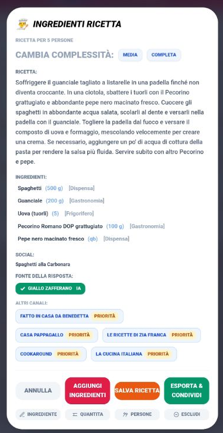

Una volta trovata la ricetta, apparirà una finestra con:

- **Lista Ingredienti**: LiSA calcola le dosi (puoi anche specificare il numero di persone!) e divide tutto per reparto. Con un tocco, puoi aggiungere solo quello che ti manca alla tua lista.
- **Guida Chef**: Troverai i passaggi per la preparazione, consigli sulle tecniche e varianti creative.
- **Link Social**: LiSA ti fornisce un link rapido alla ricerca del piatto sul canale originale, così potrai guardare video o foto del risultato finale.

#### I Pulsanti della Ricetta

All'interno della schermata della ricetta, trovi diversi strumenti per gestire al meglio la tua preparazione:

- **Annulla**: Chiude la finestra della ricetta e torna alla lista della spesa senza apportare modifiche.
- **Aggiorna ingredienti**: Conferma le modifiche apportate alla lista degli ingredienti e li aggiunge (o aggiorna) nella tua lista della spesa principale.
- **Salva ricetta**: Aggiunge la ricetta ai tuoi preferiti, permettendoti di ritrovarla velocemente in futuro senza doverla ricercare.
- **Esporta e condividi**: Genera un testo formattato della ricetta (ingredienti e procedimento) che puoi copiare o inviare tramite le tue app di messaggistica.

  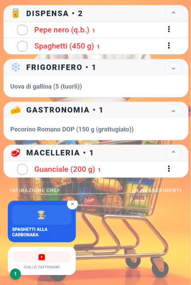

#### Personalizzazione degli Ingredienti

Ogni ingrediente può essere modificato prima di essere aggiunto alla lista:

- **Modifica ingrediente**: Tocca il nome di un ingrediente per correggerlo o rinominarlo secondo le tue preferenze.
- **Quantità**: Puoi variare la dose suggerita per ogni singolo articolo.
- **Persone**: Regola il numero di porzioni desiderate; LiSA ricalcolerà automaticamente le dosi di tutti gli ingredienti in proporzione.
- **Escludi**: Se hai già un ingrediente in casa, puoi deselezionarlo per evitare che venga aggiunto inutilmente alla lista della spesa.

#### Riferimenti alle ricette in lista

Quando aggiungi ingredienti da una ricetta, noterai un **piccolo numero** (o più di uno, se lo stesso prodotto serve per più piatti diversi) accanto al nome dell'articolo nella lista della spesa.

Questo numero ha una funzione di **rimando logico**: serve a farti capire immediatamente a quale ricetta (e a quale canale social) si riferisce quell'ingrediente. In questo modo, guardando la lista, saprai sempre perché quel prodotto è lì e potrai risalire facilmente alle istruzioni dello Chef corrispondente nella sezione Ricette o tramite il link social fornito inizialmente.

### Gestione Negozi e Carte Fedeltà

  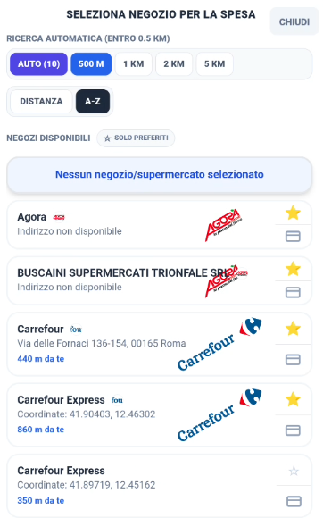

LiSA integra un sistema avanzato per gestire i tuoi punti vendita e le relative tessere fedeltà, eliminando la necessità di portafogli ingombranti e velocizzando il momento del pagamento.

#### Selezione del Negozio

Per organizzare la tua spesa, LiSA ha bisogno di sapere in quale negozio ti trovi. Puoi selezionare il negozio in tre modi:

- **Geolocalizzazione Intelligente**: Grazie al GPS del tuo smartphone, LiSA individua automaticamente i supermercati nelle tue vicinanze e te li propone in cima alla lista. Questo ti permette di cambiare negozio con un semplice tocco non appena arrivi nel parcheggio.
- **Negozi Preferiti**: Puoi contrassegnare i tuoi punti vendita abituali con una **stella (⭐)**. Questi appariranno sempre tra le prime posizioni, facilitando la selezione manuale anche se il GPS è disattivato.
- **Ricerca e Inserimento**: Se un negozio non è presente nel database, puoi cercarlo tramite l'apposita barra di ricerca o aggiungerlo manualmente definendo il nome e il reparto principale.

#### Carte Fedeltà e Tessere Punti

Ogni negozio può avere una o più carte fedeltà associate. Una volta configurate, LiSA le gestisce in modo intelligente:

- **Associazione Automatica**: Quando selezioni un negozio (es. "Coop"), LiSA mostra automaticamente il logo della relativa carta fedeltà nell'header dell'app.
- **Visualizzazione Rapida**: Non serve navigare nei menu. Il logo della carta è sempre visibile in alto a destra; basta un tocco per visualizzare il codice a barre o il QR code pronto per la scansione.
- **Supporto Multi-Carta**: Se per un singolo negozio possiedi più tessere (o vuoi gestire anche quelle dei familiari), puoi aggiungerle tutte e selezionare quella predefinita.

#### Codice Fiscale e Lotteria degli Scontrini

Oltre alle tessere dei supermercati, LiSA ti permette di memorizzare due codici fondamentali per i tuoi acquisti quotidiani:

- **Codice Fiscale**: Indispensabile se usi LiSA anche in **Farmacia** o in altri negozi dove è necessario registrare la spesa per detrazioni fiscali o fatturazione. Averlo in LiSA ti evita di dover cercare ogni volta la tessera sanitaria nel portafoglio.
- **Lotteria degli Scontrini**: LiSA ti permette di salvare il tuo **Codice Lotteria** personale. Partecipare alla lotteria è importante perché ti offre la possibilità di vincere premi in denaro semplicemente effettuando acquisti con pagamenti elettronici. Per maggiori dettagli sul funzionamento e su come generare il tuo codice, puoi consultare il [sito ufficiale dell'Agenzia delle Entrate](https://www.agenziaentrate.gov.it/portale/lotteria-degli-scontrini1) o il [portale dedicato](https://www.lotteriadegliscontrini.gov.it/).

Questi codici sono trattati come "carte speciali" e sono sempre a portata di mano insieme alle tue carte fedeltà tramite i tasti rapidi nella barra delle funzioni o comandi vocali dedicati.

### Utilizzo dei codici alla Cassa

Quando sei arrivato al momento del pagamento, LiSA rende tutto semplicissimo:

1. **Accesso Rapido**: Se hai selezionato il negozio corretto, il logo della carta fedeltà (o il pulsante della Lotteria/Codice Fiscale) sarà già visibile nell'header o nella barra delle funzioni.
2. **Visualizzazione a tutto schermo**: Tocca l'icona del codice che ti serve. Per facilitare la lettura da parte degli scanner dei negozi (che a volte faticano a leggere attraverso il vetro dello smartphone), fai **doppio click** sul codice a barre o sul QR Code: questo si aprirà a **tutto schermo** e la luminosità del telefono aumenterà automaticamente per garantire una scansione perfetta.
3. **Passaggio Rapido**: Se devi mostrare sia la carta fedeltà che il codice lotteria, puoi scorrere lateralmente o usare i tasti rapidi nella finestra del codice a tutto schermo.

### Gestione Scontrini e Prezzi

La gestione economica è uno dei pilastri di LiSA. Capire come il programma interpreta i dati visivi e come gestisce i prezzi è fondamentale per ottimizzare la tua spesa.

#### Scontrini vs Scaffali: Quale scegliere?

Nella barra delle funzioni, sotto l'icona della lista, trovi il menu **Scontrini e Scaffali**. Sebbene entrambi utilizzino l'IA per leggere dati dal mondo reale, hanno finalità e livelli di difficoltà differenti:

- **Analisi Scaffali (Più semplice)**: È la modalità ideale mentre fai la spesa. Inquadrando un cartellino del prezzo sullo scaffale, l'IA legge chiaramente il nome del prodotto e il prezzo esposto. Poiché i cartellini sono pensati per essere letti facilmente dagli umani, l'IA commette raramente errori. È il modo più veloce per popolare il tuo database prezzi "in diretta".
- **Analisi Scontrino (Più complessa)**: È una sfida tecnologica maggiore. Gli scontrini hanno spesso abbreviazioni criptiche (es. "MELA G. DEL. KG"), caratteri poco chiari o carta stropicciata. LiSA fa un lavoro incredibile per decifrarli, ma richiede più attenzione (buona luce e inquadratura piatta) e potrebbe necessitare di una piccola revisione manuale post-scansione.

#### Il Database "Prodotti"

Mentre **Scontrini e Scaffali** è lo strumento di *input* (come inserisci i dati), il menu **Prodotti** (che trovi in **Impostazioni > Libreria Prodotti**) è il tuo *archivio*. Qui puoi vedere l'elenco di tutto ciò che LiSA conosce, correggere i nomi imparati male dall'IA e gestire i reparti predefiniti.

#### Gestione e Visualizzazione dei Prezzi

LiSA non si limita a memorizzare un prezzo, ma crea uno storico intelligente per aiutarti a risparmiare.

- **Come "modificare" i prezzi**:
    In LiSA, non si modifica direttamente il prezzo finale, ma si agisce sui parametri che lo determinano per ottenere un confronto equo tra prodotti diversi:
    - **In fase di analisi**: Dopo la scansione, puoi toccare una riga per definire o correggere l'**unità di misura** (kg, litri, pezzi) e la **quantità** del prodotto.
    - **Calcolo Costo per Unità**: LiSA utilizzerà questi dati per calcolare automaticamente il **costo per unità singola** (es. prezzo al kg o al litro). Questo è l'unico valore che permette un confronto reale tra, ad esempio, un pacco di pasta da 500g e uno da 1kg, evidenziando quale sia effettivamente il più conveniente.
    - **Nella Libreria Prodotti**: Puoi affinare questi dati in qualunque momento entrando nei dettagli del prodotto per assicurarti che il confronto economico sia sempre basato su unità di misura coerenti.
- **Modalità Operativa Consigliata**:
    Non serve fermarsi davanti a ogni scaffale per controllare i dati. La strategia migliore è la velocità: scatta foto rapide a scontrini e cartellini mentre sei nel negozio o appena hai finito la spesa. Potrai poi elaborare le immagini con l'IA e correggere eventuali dettagli con tutta calma una volta tornato a casa o nei momenti di relax, costruendo il tuo database del risparmio senza stress.
- **Visualizzazione nella Lista della Spesa**:
    - Quando aggiungi un prodotto da acquistare, se LiSA conosce già il suo prezzo (perché lo hai comprato in precedenza o scansionato), questo apparirà accanto al nome.
    - Se il prodotto è associato a un negozio specifico, LiSA ti mostrerà il prezzo praticato in quel punto vendita, aiutandoti a prevedere il totale della spesa prima ancora di arrivare in cassa.
- **Visualizzazione nella Configurazione**:
    - Nella gestione prodotti, vedrai accanto a ogni articolo l'ultimo prezzo registrato e il relativo "Semaforo del Risparmio" (Verde/Giallo/Rosso) che confronta l'ultimo prezzo con la media storica di quel prodotto.

#### Perché è importante?

Una gestione curata dei prezzi trasforma LiSA da semplice promemoria a consulente finanziario: saprai sempre se quel "Prezzo Offerta" è davvero conveniente rispetto a quanto pagato il mese scorso o se in un altro negozio vicino lo stesso prodotto costa abitualmente meno.

#### Consigli per l'AI (Migliori risultati)

Per far sì che LiSA legga correttamente i dati, specialmente i difficili scontrini:

1. **Luce buona**: Evita ombre eccessive sullo scontrino.
2. **Inquadratura**: Cerca di tenere lo scontrino ben dritto e piatto. Se lo scontrino è molto lungo, scatta più foto a pezzi diversi.
3. **Fuoco**: Assicurati che le scritte dei prezzi siano ben leggibili sullo schermo prima di scattare.
4. **Revisione**: Prendi l'abitudine di dare un'occhiata veloce all'elenco che l'IA genera dopo la scansione; un piccolo "tap" per correggere un errore dell'IA garantisce che la tua cronologia prezzi rimanga precisa e affidabile.

---

## Impostazioni

Dalla sezione Impostazioni puoi personalizzare la tua esperienza:

- **Gestione Reparti**: Aggiungi, rinomina o cambia l'ordine dei reparti per adattarli al tuo supermercato di fiducia.
- **Libreria Prodotti**: Gestisci l'elenco dei prodotti che LiSA ha imparato a conoscere.
- **Aspetto**:
  - **Colori e Tema**: Scegli tra tema chiaro, scuro o automatico e imposta il tuo colore preferito per l'interfaccia.
  - **Icone dei Reparti**: Puoi attivare o disattivare la visualizzazione delle icone emoji accanto ai prodotti nella lista della spesa.
  - **Intensità Sfondo**: Regola la trasparenza della filigrana di sfondo per migliorare la leggibilità.
  - **Dimensione Carattere**: Personalizza la grandezza dei testi per un comfort visivo ottimale.
- **Comportamento**:
  - **Invio Vocale Automatico**: Se attivato, LiSA elaborerà il comando vocale non appena smetterai di parlare.
  - **Attesa Invio**: (Disponibile se l'invio automatico è attivo) Regola i secondi di attesa dopo la fine del comando vocale prima che LiSA lo esegua. Utile per avere il tempo di annullare o controllare il testo.
  - **Durata Suggerimenti**: Imposta per quanti secondi la finestra di suggerimento prodotti deve restare visibile sullo schermo prima di chiudersi da sola.
- **AI (Intelligenza Artificiale)**:
  - Gestisci le modalità delle ricette, i canali social preferiti e le opzioni avanzate di riconoscimento tramite fotocamera.
- **Database e Cronologia**: Svuota la cronologia dei prezzi o i prodotti suggeriti se vuoi ricominciare da capo.

---

## Account

### Gestione Profilo e Licenze

Qui puoi gestire i tuoi dati personali e controllare lo stato del tuo abbonamento LiSA. L'account ti permette di sincronizzare i tuoi dati su più dispositivi.

### Backup e Ripristino Cloud

Non rischiare di perdere la tua lista e la cronologia dei prezzi! LiSA offre un sistema di backup automatico:

- **Backup Manuale**: Salva i tuoi dati sul cloud in qualunque momento.
- **Ripristino**: Se cambi telefono, ti basta accedere al tuo account per ritrovare tutto esattamente come lo avevi lasciato.

### Privacy e Sicurezza

I tuoi dati della spesa sono privati. LiSA non condivide le tue abitudini di acquisto con terze parti per scopi pubblicitari. Le analisi AI vengono effettuate utilizzando protocolli sicuri.

## Novità e Notifiche

LiSA ti tiene sempre aggiornato sulle novità e sullo stato del servizio.

  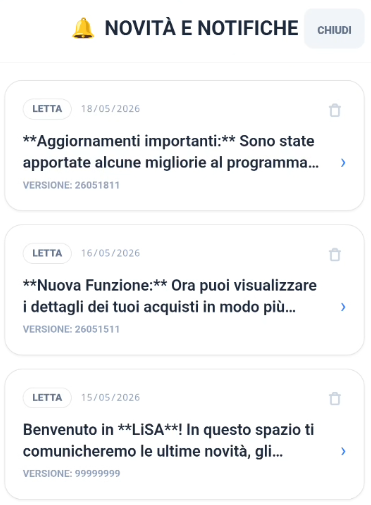

LiSA ti tiene sempre aggiornato sulle nuove funzionalità e ti fornisce consigli utili tramite un sistema di notifiche integrato:

- **Avviso Nuove Notifiche**: Quando ci sono delle novità non ancora lette, apparirà un indicatore visivo (un pallino blu o un'icona a forma di campanella) nell'area dell'account o nella schermata dello stato licenza.
- **Cronologia Notifiche**: Puoi consultare l'elenco completo delle comunicazioni passate selezionando la voce **"Novità e Notifiche"** dal menu Account.
- **Dettaglio e Gestione**: Toccando una notifica potrai leggerne il contenuto completo. Puoi anche eliminare le notifiche che non ti interessano più per tenere pulita la tua bacheca.

---

## Prossimi Sviluppi (Versione Premium)

Stiamo lavorando per rendere LiSA ancora più utile:

- **Condivisione Real-Time**: Gestisci la stessa lista con i membri della tua famiglia in tempo reale.
- **Statistiche Avanzate**: Grafici dettagliati sulle tue spese mensili divisi per categoria.
- **Volantini Intelligenti**: Ricevi avvisi sulle offerte dei prodotti che hai solitamente in lista.

---

## Diagnostica AI

In caso di problemi con l'assistente intelligente, puoi consultare la sezione Diagnostica dal menu Account. Qui troverai i log delle comunicazioni con l'IA per capire se ci sono errori di connessione o problemi con la tua chiave API.

  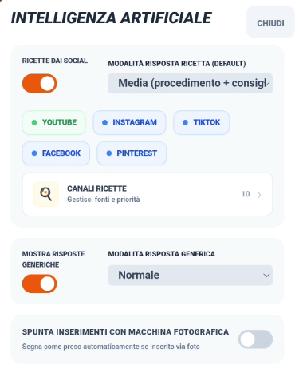

---

## Azioni Rapide e Comandi Vocali

LiSA permette di eseguire alcune operazioni comuni istantaneamente tramite comandi vocali o testuali nella barra di inserimento. Queste azioni non richiedono l'intervento dell'IA generativa e vengono eseguite immediatamente.

### Comandi disponibili:

1. **Pulisci presi**: Rimuove istantaneamente dalla lista tutti i prodotti già contrassegnati come acquistati.
   - _Esempi_: "Pulisci i presi", "Elimina presi", "Togli prodotti presi".

1. **Mostra la carta di [Nome Negozio]**: Seleziona automaticamente la carta fedeltà associata al negozio e la apre direttamente a tutto schermo (codice a barre).
   - _Esempi_: "Mostra la carta di Conad", "Apri carta Coop", "Mostrami la carta Esselunga", "Fammi vedere la carta della Lidl".

1. **Mostra Codice Lotteria / Codice Fiscale**: Apre istantaneamente a tutto schermo il codice relativo per la scansione in cassa.
   - _Esempi_: "Mostra codice lotteria", "Apri il mio codice fiscale", "Fammi vedere il codice lotteria scontrini".

1. **Riduci o Espandi i reparti**: Permette di chiudere o aprire tutti i raggruppamenti per reparto nella lista della spesa.
   - _Esempi_: "Riduci reparti", "Collassa i reparti", "Espandi reparti", "Apri reparti".

1. **Utilizza il colore [Colore]**: Cambia istantaneamente il colore principale dell'interfaccia di LiSA.
   - _Colori supportati_: Blu, Verde, Viola, Arancio, Rosso (o Rosa), Bianco, Nero.
   - _Esempi_: "Usa il colore verde", "Imposta colore viola", "Cambia il colore in arancio".

---

### Scorciatoie nell'Header

Se hai selezionato un negozio con una carta fedeltà associata, il logo della carta appare nell'header dell'app. Oltre al click singolo per aprire la gestione carte, puoi usare queste scorciatoie:

- **Doppio Click (o pressione prolungata)** sul logo: apre direttamente il codice a barre della carta a tutto schermo, pronto per la scansione in cassa.

---

## Utilizzo a mani libere (Android Auto / Ok Google)

LiSA è progettata per essere utilizzata in totale sicurezza mentre guidi o hai le mani occupate, grazie alla profonda integrazione con l'Assistente Google.

### Comandi Google Assistant

Per evitare che Google Assistant confonda "LiSA" con un contatto della tua rubrica (es. Elisabetta), è importante usare la preposizione **"su"** o **"con"** LiSA.

1. **Aggiunta diretta (La più efficace)**: _"Ok Google, aggiungi latte su LiSA"_ oppure _"Ok Google, con LiSA aggiungi pane"_.
2. **Varianti supportate**: _"Ok Google, metti uova sulla lista di LiSA"_.
3. **Apertura intelligente**: _"Ok Google, apri LiSA"_.

### Feedback Vocale (Modalità Guida)

Nelle **Impostazioni > Comportamento**, puoi attivare il **Feedback Vocale**.
Quando questa opzione è attiva, LiSA ti risponderà verbalmente ogni volta che aggiungi un prodotto (es: _"Ho aggiunto latte alla lista"_). Questo ti permette di avere la certezza che il comando sia stato recepito correttamente senza dover guardare lo schermo del telefono.

---

## Consigli ed esempi di utilizzo

Per sfruttare al massimo LiSA, specialmente se hai attivato l'Assistente AI, prova a interagire in modo naturale. Ecco alcuni esempi di quello che puoi fare:

### 📝 Compilazione Intelligente della Lista

Invece di inserire un prodotto alla volta, prova a scrivere (o dettare) intere frasi:

- _"Aggiungi latte, uova, farina e un chilo di zucchero"_
- _"Prendi tutto il necessario per fare una torta di mele stasera"_
- _"Mi servono le cose per le pulizie di casa: sgrassatore, candeggina e spugne"_

### 👨‍🍳 Lo Chef Personale

Ricorda di usare la parola **RICETTA** per attivare l'analisi completa:

- _"Ricetta lasagne alla bolognese per 6 persone"_
- _"Cosa posso cucinare con zucchine e gamberetti? Dammi la ricetta"_
- _"Ricetta tiramisù senza uova"_

### 💡 Assistenza e Suggerimenti

Puoi chiedere a LiSA consigli che vadano oltre la semplice lista:

- _"Quali sono i prodotti di stagione a Maggio?"_
- _"Suggeriscimi una cena leggera e veloce"_
- _"Come posso pulire le macchie di vino rosso dal tappeto?"_

### 📸 Fotografia di Scaffali ed Etichette

Uno degli strumenti più potenti di LiSA è l'analisi fotografica:

- **Scaffali Interi**: Inquadra una corsia o uno scaffale: LiSA è in grado di leggere e memorizzare un numero elevato di prodotti, prezzi e descrizioni in un unico scatto.
- **Prodotti Confezionati ed Etichette**: Scatta una foto all'etichetta di un singolo prodotto impacchettato (come prosciutto, formaggi o carne). L'analisi dell'etichetta permette di registrare il prezzo esatto al dettaglio presso quello specifico negozio, rendendolo facilmente consultabile per i tuoi confronti futuri.
- Questo ti permette di creare un database dettagliato e preciso dei prodotti del tuo negozio preferito in pochi secondi, senza dover inserire nulla manualmente.

### 💰 Risparmio e Confronto Prezzi

Usa le funzioni di analisi per tenere sotto controllo il portafoglio:

- Scatta una foto allo scontrino appena uscito dal negozio per aggiornare i prezzi e i prodotti.
- **Confronto tra Negozi**: Consulta la cronologia dei prezzi per capire se il prodotto che stai guardando è più conveniente nel negozio dove ti trovi o se solitamente lo acquisti a meno altrove.
- **Il Semaforo dei Prezzi**: Usa gli indicatori colorati nella cronologia per decidere istantaneamente se l'acquisto è un affare o se conviene aspettare un'offerta.

---

## FAQ / Risoluzione Problemi

**D: La chiave dell'assistente non funziona, cosa faccio?**
R: Controlla di aver copiato bene tutto il codice. Assicurati che non ci siano spazi vuoti prima o dopo la stringa.

**D: L'analisi dello scontrino è sbagliata.**
R: Succede se la foto è mossa o c'è poca luce. Prova a rifare la foto seguendo i nostri consigli!

**D: Ho un nuovo telefono, come riprendo i miei dati?**
R: Se usavi il backup cloud, fai il login e scegli "Ripristina". Se avevi un backup sul telefono, dovrai spostare il file sul nuovo dispositivo.

**D: Perché il programma non riconosce automaticamente i reparti dei prodotti?**
R: Il riconoscimento automatico dei reparti è una funzione legata all'Intelligenza Artificiale. Se l'Assistente AI non è attivo o non è stata inserita una chiave API valida, LiSA non può determinare autonomamente la categoria di un nuovo prodotto. In questo caso, il programma ti chiederà esplicitamente di selezionare manualmente il reparto di appartenenza durante l'inserimento.

**D: Ho chiesto a LiSA come preparare un piatto (es. la pizza), ma mi ha dato una risposta generica senza la ricetta completa. Come posso risolvere?**
R: A volte l'intelligenza artificiale può interpretare la tua domanda come una curiosità generica. Per essere sicuro di attivare correttamente la funzione "Chef" e ricevere la ricetta completa di dosi, ingredienti e procedimento, utilizza sempre la parola **"RICETTA"** all'interno della tua richiesta (ad esempio: _"Ricetta pizza fatta in casa"_ oppure _"Dammi la ricetta della carbonara"_).

**D: Ho posto una domanda o fatto una richiesta a LiSA, ma sembra non succeda nulla o la risposta non è quella sperata.**
R: L'intelligenza artificiale lavora meglio quando ha a disposizione dettagli e contesto. Se una richiesta è troppo corta o vaga, LiSA potrebbe non riuscire a interpretarla correttamente. Cerca di essere il più preciso possibile: invece di un generico _"Che tempo fa?"_, prova con _"Che tempo fa oggi a Roma per capire se devo andare a fare la spesa a piedi?"_. Più dettagli fornirai, più l'assistente sarà in grado di fornirti una risposta utile e pertinente.

---

## Utilizzo dell'Intelligenza Artificiale

LiSA utilizza modelli di IA avanzati per comprendere le tue richieste in linguaggio naturale. Per ottenere i migliori risultati e capire come LiSA interpreta i tuoi messaggi, ecco alcune regole fondamentali:

### Categorie di Riconoscimento

Ogni frase che scrivi o detti viene classificata in una di queste quattro categorie:

- **LISTA**: Usata per aggiungere prodotti alla spesa. Puoi scrivere elenchi semplici o frasi discorsive (es: "Aggiungi latte, pane e 2 pacchi di pasta").
- **RICETTA**: Si attiva quando chiedi istruzioni di cucina. Per essere sicuro di attivarla, usa sempre la parola "Ricetta" (es: "Ricetta lasagne").
- **ELIMINAZIONE**: Riconosce l'intenzione di togliere o spuntare prodotti. Usa verbi chiari come "togli", "elimina", "cancella" o "fatto" (es: "Togli il burro dalla lista").
- **GENERICA**: Si attiva per domande, consigli o curiosità. Ora LiSA è in grado di rispondere anche a domande specifiche sui prodotti che hai già in lista (es: "Qual è il prodotto più calorico tra quelli segnati?" o "Cosa posso cucinare con quello che ho in lista?").

### Regole di Precedenza e Conflitti

1. **Comandi Rapidi**: Alcune frasi hanno la precedenza assoluta sull'IA per garantirti velocità. Ad esempio, "pulisci presi", "riduci reparti" o "mostra carta [nome]" vengono eseguiti istantaneamente.
2. **Conflitto Aggiunta/Rimozione**: Se in una stessa frase chiedi di aggiungere e togliere prodotti contemporaneamente (es: "aggiungi latte e togli pane"), LiSA segnalerà un **Comando Ambiguo**. Per sicurezza, ti chiederà di inserire un'operazione alla volta.
3. **Comando "Mostra"**: Se chiedi di mostrare una carta o tessera fedeltà, LiSA cercherà sia tra i nomi che hai dato alle carte sia tra i nomi dei negozi associati. Se non trova nulla e la frase è ambigua, ti avviserà del mancato riconoscimento.

### Consigli Pratici

- **Sii specifico**: Più dettagli fornisci (marche, pesi, note), meglio LiSA saprà organizzare la tua lista.
- **Una cosa alla volta**: Evita di mischiare domande generiche e comandi di lista nello stesso messaggio.
- **Controlla la Lista**: Quando fai domande sulla lista ("Cosa posso cucinare con i prodotti in elenco?"), assicurati che la lista non sia vuota, altrimenti LiSA ti risponderà che non ha dati da analizzare.

---

## Note finali

Ricorda di consultare periodicamente questo manuale per scoprire nuove funzionalità e consigli per usare LiSA al meglio!
